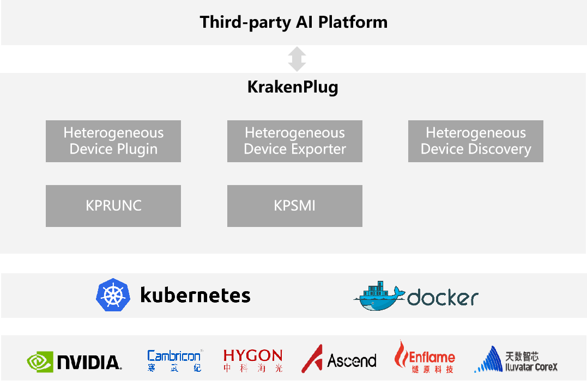

# KrakenPlug

KrakenPlug是人工智能集群中管理异构AI计算设备的插件和工具集，包含异构设备插件、异构设备Prometheus Exporter、异构设备发现等，AI集群管理平台可以通过集成KrakenPlug减少相关软件开发工作量，快速获得异构AI设备管理的能力。

## 项目架构




## 安装部署

执行以下命令增加Chart仓库：

```
helm repo add krakenplug https://openi.pcl.ac.cn/Kraken/KrakenCharts/raw/branch/master
```

添加成功后同步仓库信息，如下：
```
helm repo update
```

这里可以先查看krakenplug已有的安装包版本，如下：
```
helm search repo krakenplug
```

然后将krakenplug对应版本的 chart 包下载到本地，并解压，如下：
```
helm pull krakenplug/krakenplug --version vx.x.x
tar -zxvf krakenplug-vx.x.x.tgz
```

### 配置values.yaml文件

部署krakenplug包时，需要修改部署包中的一些参数，这些参数都配置在安装包解压后目录中的values.yaml文件。

### 安装KrakenPlug
进入到解压后的krakenplug目录，执行helm install进行安装：

```
kubectl create ns krakenplug
helm install krakenplug -n krakenplug ./  --values values.yaml
```

### 升级KrakenPlug
如果已经使用helm install成功安装过chart包，执行helm upgrade进行更新：

```
helm upgrade krakenplug -n krakenplug ./  --values values.yaml
```


## 异构设备插件

异构设备插件主要是基于Kubernetes设备插件机制，提供各类AI设备资源的发现、分配和健康状态上报功能，使Kubernetes能够管理各类AI设备资源，用户创建Pod时通过指定AI设备资源名称来使用对应资源。

| AI设备厂商名称 | Kubernetes资源名称             |
| -------------- | ------------------------------ |
| Nvidia         | krakenplug.pcl.ac.cn/nvidia    |
| Ascend         | krakenplug.pcl.ac.cn/ascend    |
| Cambricon      | krakenplug.pcl.ac.cn/cambricon |


## 异构设备Exporter

异构设备Exporter基于Prometheus 规范实现了Metrics接口，可实时获取AI设备的利用率、显存、温度等运行指标信息。

| **指标名称**                   | **指标说明**     | **指标标签字段**                     | **字段类型** | **指标数值** |
| ------------------------------ | ---------------- | ------------------------------------ | ------------ | ------------ |
| krakenplug_device_util         | 设备资源利用率   | node_name、pod、device_index、vendor | integer      | 单位：百分比 |
| krakenplug_device_memory_used  | 设备显存已使用量 | node_name、pod、device_index、vendor | integer      | 单位：MB     |
| krakenplug_device_memory_total | 设备显存总量     | node_name、pod、device_index、vendor | integer      | 单位：MB     |

| 标签字段名称 | 标签字段说明                                |
| ------------ | ------------------------------------------- |
| node_name    | 节点名称                                    |
| pod          | pod名称                                     |
| device_index | 设备索引                                    |
| vendor       | 设备厂商，当前支持nvidia、ascend、cambricon |


## 异构设备Discovery

异构设备Discovery将AI设备型号等信息通过label的方式添加到Kubernets Node中，以供业务层实现精细化管理。

| **label名称**                      | **label说明**      | **字段类型** |
| ---------------------------------- | ------------------ | ------------ |
| krakenplug.pcl.ac.cn/device.vendor | 设备厂商           | string       |
| krakenplug.pcl.ac.cn/device.model  | 设备型号           | string       |
| krakenplug.pcl.ac.cn/device.memory | 设备显存总量（MB） | integer      |
